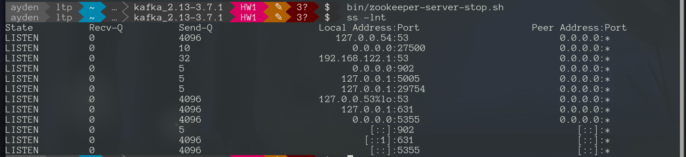

## HW1: Запуск kafka

### Запуск из кода
Скачать
```
wget https://downloads.apache.org/kafka/3.7.1/kafka_2.13-3.7.1.tgz
```

Разархивируем
```
tar -xzf kafka_2.13-3.7.1.tgz
cd cd kafka_2.13-3.7.1/
```

Запускаем zookeeper
```
bin/zookeeper-server-start.sh -daemon config/zookeeper.properties
```

Запускаем kafka
```
bin/kafka-server-start.sh -daemon config/server.properties
```

Создаем тему
```
bin/kafka-topics.sh --create --topic quickstart --bootstrap-server localhost:9092
bin/kafka-topics.sh --describe --topic quickstart --bootstrap-server localhost:9092
```

Записываем в тему
```
bin/kafka-console-producer.sh --topic quickstart --bootstrap-server localhost:9092
```

Читаем из темы
```
bin/kafka-console-consumer.sh --topic quickstart --from-beginning --bootstrap-server localhost:9092
```

Останавливаем kafka
```
bin/kafka-server-stop.sh
```

Останавливаем zookeeper
```
bin/zookeeper-server-stop.sh
```

### Запуск в контенере

Запуск контейнеров 
```
docker-compose up -d
```

Создаем тему
```
docker exec -ti kafka kafka-topics --create --topic quickstart --bootstrap-server localhost:19092
```
Записываем в тему
```
docker exec -ti kafka kafka-console-producer --topic quickstart --bootstrap-server localhost:19092
```

Читаем из темы
```
docker exec -ti kafka kafka-console-consumer --topic quickstart --from-beginning --bootstrap-server localhost:19092
```

### Основные операции
* zookeeper-server-start.sh – запуск Zookeeper
* zookeeper-server-stop.sh – останов Zookeeper
* kafka-server-start.sh – запуск Kafka брокера
* kafka-server-stop.sh – останов Kafka брокера
* kafka-console-producer.sh – консольный Producer
* kafka-console-consumer.sh – консольный Consumer
* kafka-topics.sh – работа с темами
* kafka-consumer-groups.sh — работа с группами потребителей