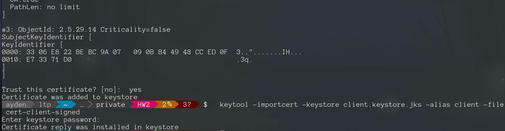

## HW2: Kraft и kafka. Настройка безопасности.

### Запуск kafka с kraft
Создаем случайный uuid и форматируем лог
```
export KAFKA_CLUSTER_ID="$(bin/kafka-storage.sh random-uuid)"

bin/kafka-storage.sh format -t $KAFKA_CLUSTER_ID -c config/server.properties
```

Создаем `server.properties`
```
process.roles=broker,controller
node.id=1
controller.quorum.voters=1@localhost:9093
listeners=PLAINTEXT://:9092,CONTROLLER://:9093
inter.broker.listener.name=PLAINTEXT
advertised.listeners=PLAINTEXT://localhost:9092
controller.listener.names=CONTROLLER
listener.security.protocol.map=CONTROLLER:PLAINTEXT,PLAINTEXT:PLAINTEXT,SSL:SSL,SASL_PLAINTEXT:SASL_PLAINTEXT,SASL_SSL:SASL_SSL
log.dirs=/tmp/kraft-combined-logs
log.retention.hours=24
log.segment.bytes=1073741824
log.retention.check.interval.ms=300000
offsets.topic.replication.factor=1
transaction.state.log.replication.factor=1
transaction.state.log.min.isr=1
```
Проверяем запуск брокера
```
bin/kafka-server-start.sh -daemon config/server.properties
```


### SASL_PLAIN
Добавляем в `server.properties`
```
sasl.enabled.mechanisms=PLAIN
sasl.mechanism.inter.broker.protocol=PLAIN
authorizer.class.name=org.apache.kafka.metadata.authorizer.StandardAuthorizer
allow.everyone.if.no.acl.found=true
security.protocol=SASL_PLAINTEXT
serviceName="Kafka"
```
и меняем PLAINTEXT на SASL_PLAINTEXT

Создаем `server_jaas.conf` с пользователями

Запускаем брокер с конфигурацией пользователей
```
KAFKA_OPTS="-Djava.security.auth.login.config=./HW2/config/server_jaas.conf" bin/kafka-server-start.sh -daemon HW2/config/server.properties
```
Проверяем аутентификацию
```
bin/kafka-topics.sh --create --topic test --bootstrap-server localhost:9092 --command-config HW2/config/client-ivanov.properties
```


### ACL
Создаем правила
```
bin/kafka-acls.sh --bootstrap-server localhost:9092 --add --allow-principal User:Ivanov --operation Write --topic test --command-config HW2/config/client-ivanov.properties

bin/kafka-acls.sh --bootstrap-server localhost:9092 --add --allow-principal User:Petrov --operation Read --topic test --command-config HW2/config/client-ivanov.properties

bin/kafka-acls.sh --list --bootstrap-server localhost:9092 --command-config HW2/config/client-ivanov.properties
```


Проверка
```
bin/kafka-topics.sh --list --bootstrap-server localhost:9092 --command-config HW2/config/client-ivanov.properties

bin/kafka-console-producer.sh --topic test --bootstrap-server localhost:9092 --producer.config HW2/config/client-ivanov.properties

bin/kafka-console-consumer.sh --topic test --bootstrap-server localhost:9092 --consumer.config HW2/config/client-ivanov.properties -from-beginning
```
ACL Topic test Write:

ACL Topic test Read:

ACL None:


### SAML_SSL
Создаем центр сертификации в виде сертификата и закрытого ключа для самоподписанных сертификатов
```
openssl req -new -x509 -keyout ca-key -out ca-cert -days 365
```
Создаем ключ и сертификат для брокера localhost
```
keytool -genkey \
-keyalg RSA \
-keystore server.keystore.jks \
-keypass password \
-alias localhost \
-validity 365 \
-storetype pkcs12 \
-storepass password \
-dname "CN=localhost,OU=Kafka,O=Otus,L=Moscow,ST=Moscow,C=RU"
```
Добавляем сертификат центра сертификации в хранилище доверия брокера
```
keytool -importcert -keystore server.truststore.jks -alias CARoot -file ca-cert
```
Экспортируем сертификат брокера, подписываем его центром сертфикации и импортируем обратно вместе с сертификатом центра сертификации
```
keytool -certreq -keystore server.keystore.jks -alias localhost -file cert-file
openssl x509 -req -CA ca-cert -CAkey ca-key -in cert-file -out cert-signed -days 365 -CAcreateserial 
keytool -importcert -keystore server.keystore.jks -alias CARoot -file ca-cert
keytool -importcert -keystore server.keystore.jks -alias localhost -file cert-signed
```


Создаем ключ и сертификат для клиента
```
keytool -genkey \
-keyalg RSA \
-keystore client.keystore.jks \
-keypass password \
-alias client \
-validity 365 \
-storetype pkcs12 \
-storepass password \
-dname "CN=client,OU=Clients,O=Otus,L=Moscow,ST=Moscow,C=RU"
```
Добавляем сертификат центра сертификации в хранилище доверия клиента
```
keytool -importcert -keystore client.truststore.jks -alias CARoot -file ca-cert
```
Экспортируем сертификат клиента, подписываем его центром сертфикации и импортируем обратно вместе с сертификатом центра сертификации
```
keytool -certreq -keystore client.keystore.jks -alias client -file cert-client-file
openssl x509 -req -CA ca-cert -CAkey ca-key -in cert-client-file -out cert-client-signed -days 365 -CAcreateserial
keytool -importcert -keystore client.keystore.jks -alias CARoot -file ca-cert
keytool -importcert -keystore client.keystore.jks -alias client -file cert-client-signed
```




Создаем конфигурацию брокера `server-ssl.properties`, на основе `server.properties` добавляем:
```
ssl.keystore.location=./private/server.keystore.jks
ssl.keystore.password=password
ssl.key.password=password
ssl.truststore.location=./private/server.truststore.jks
ssl.truststore.password=password
ssl.client.auth=requested
security.inter.broker.protocol=SASL_SSL
ssl.endpoint.identification.algorithm=
```
и меняем SASL_PLAINTEXT на SASL_SSL

В конфигурацию клинтов доабавляем
```
security.protocol=SASL_SSL
ssl.truststore.location=./private/client.truststore.jks
ssl.truststore.password=password
```
Запускаем брокера и проверяем подключение клиентами
```
KAFKA_OPTS="-Djava.security.auth.login.config=./config/server_jaas.conf" bin/kafka-server-start.sh -daemon ./config/server-ssl.properties
```

### Основные операции
* kafka-acls.sh - работа с ACL
* keytool — инструмент Java для управления сертификатами