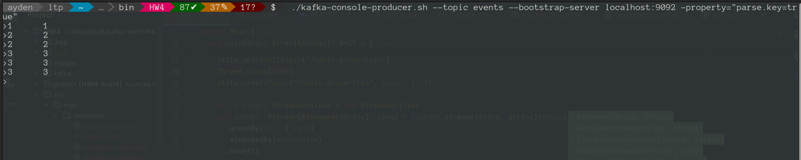
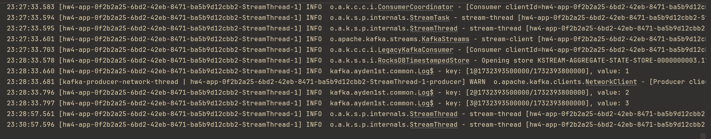
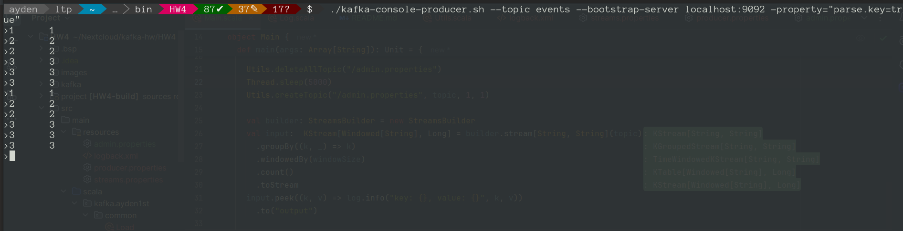
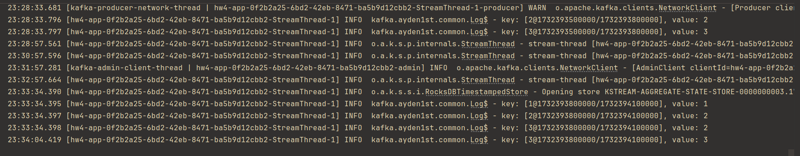

## HW4: Разработка приложения Kafka Streams

### Scala: Streams app
Импортируются библиотеки
```scala
import kafka.ayden1st.common._
import org.apache.kafka.streams.KafkaStreams
import org.apache.kafka.streams.kstream.{TimeWindows, Windowed}
import org.apache.kafka.streams.scala.ImplicitConversions._
import org.apache.kafka.streams.scala.serialization.Serdes._
import org.apache.kafka.streams.scala._
import org.apache.kafka.streams.scala.kstream._
import java.util.Properties
import java.time.Duration
```
Задаются переменные для топика и длительность сессии
```scala
val topic: String= "events"
val windowSize: TimeWindows = TimeWindows.ofSizeWithNoGrace(Duration.ofMinutes(5))
```
Создается билдер
```scala
val builder: StreamsBuilder = new StreamsBuilder
```
Создается топология:
* сообщения читаются из топика
* группируются по ключу
* задается длительность сессии
* считается
* отправляется в поток
* пишется в лог
* отправляется в выходной топик
```scala
val input:  KStream[Windowed[String], Long] = builder.stream[String, String](topic)
  .groupBy((k, _) => k)
  .windowedBy(windowSize)
  .count()
  .toStream
input.peek((k, v) => log.info("key: {}, value: {}", k, v))
  .to("output")
```
Создается поток и запускается поток
```scala
val props_streams: Properties = Load.loadProperties("/streams.properties")
val kafkaStreams = new KafkaStreams(builder.build(), props_streams)
kafkaStreams.start()
```
Ожидается сигнал для остановки
```scala
sys.ShutdownHookThread {
  kafkaStreams.close(Duration.ofSeconds(10))
  log.info("app stopped")
}
```
### Проверка
Отправляем сообщения в топик events командой
```
kafka-console-producer.sh --topic events --bootstrap-server localhost:9092 -property="parse.key=true"
```

Подсчитанные сообщения сессии

Ждем 5 минут, отправляем сообщения в топик events

Подсчитанные сообщения сессии
