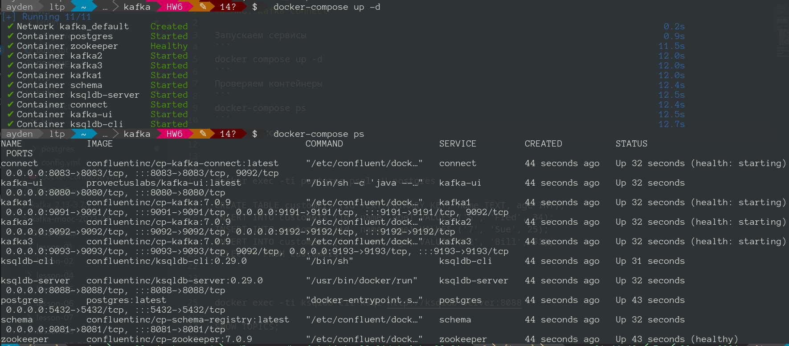
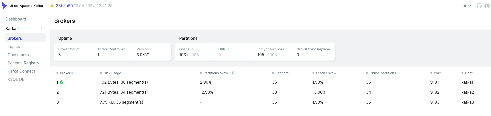
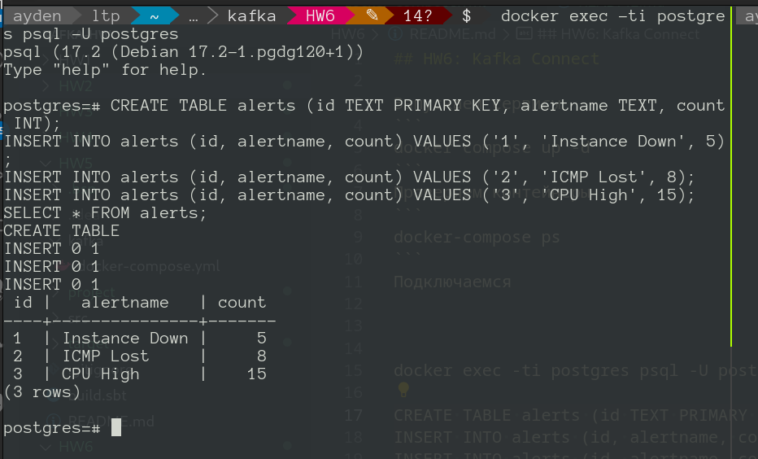
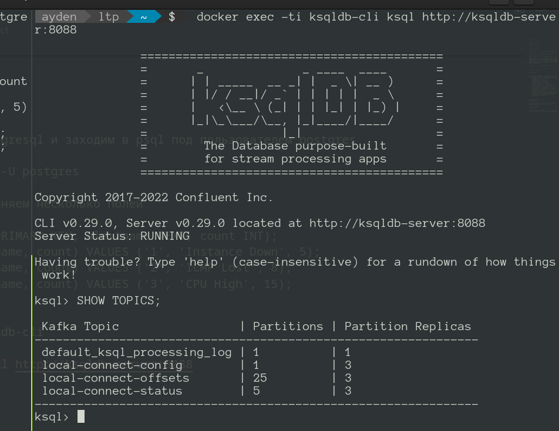
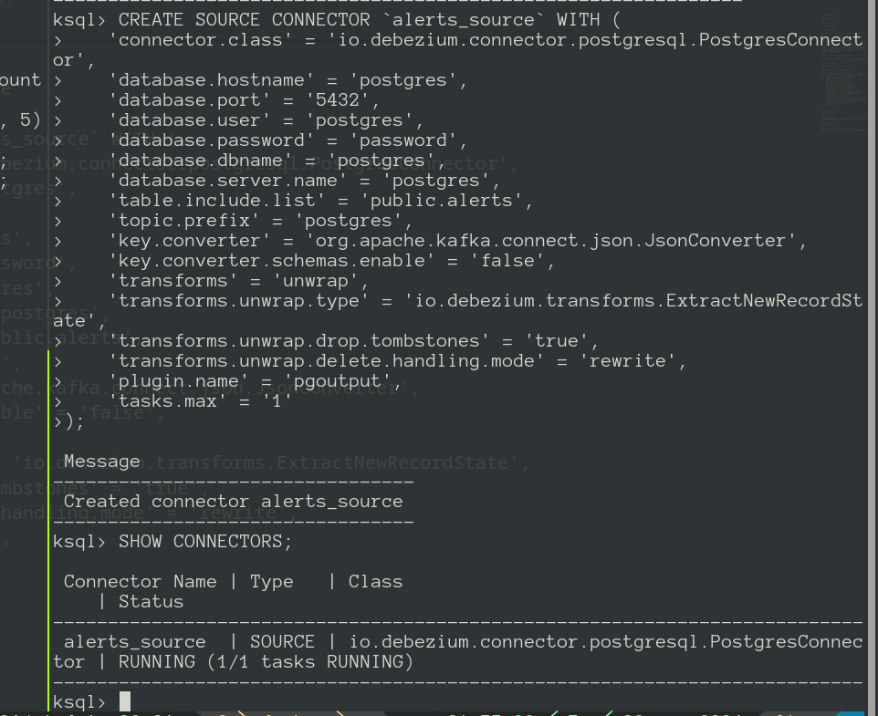
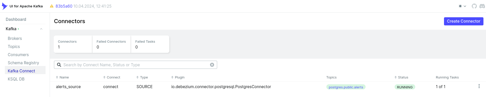
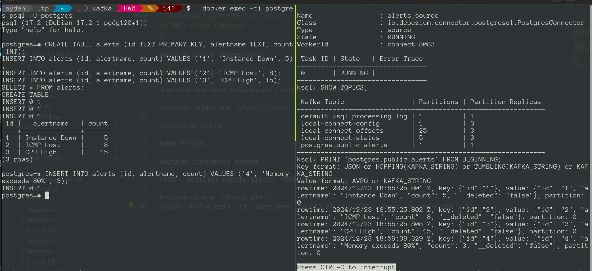
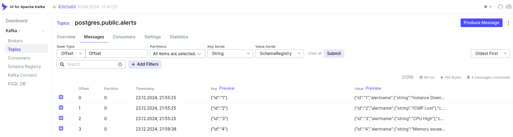

## HW6: Kafka Connect

Запускаем сервисы
```
docker compose up -d
```
Проверяем контейнеры
```
docker-compose ps
```


Подключаемся к контейнеру postgresql и заходим в psql под пользователем postgres 
```
docker exec -ti postgres psql -U postgres
```
Создаем таблицу alerts и заполняем несколько полей
```
CREATE TABLE alerts (id TEXT PRIMARY KEY, alertname TEXT, count INT);
INSERT INTO alerts (id, alertname, count) VALUES ('1', 'Instance Down', 5);
INSERT INTO alerts (id, alertname, count) VALUES ('2', 'ICMP Lost', 8);
INSERT INTO alerts (id, alertname, count) VALUES ('3', 'CPU High', 15);
SELECT * FROM alerts;
```

Подключаемся к контейнеру ksqldb-cli
```
docker exec -ti ksqldb-cli ksql http://ksqldb-server:8088
```
Проверяем топики
```
SHOW TOPICS;
```

Создаем коннектор alerts_source
```
CREATE SOURCE CONNECTOR `alerts_source` WITH (
    'connector.class' = 'io.debezium.connector.postgresql.PostgresConnector',
    'database.hostname' = 'postgres',
    'database.port' = '5432',
    'database.user' = 'postgres',
    'database.password' = 'password',
    'database.dbname' = 'postgres',
    'database.server.name' = 'postgres',
    'table.include.list' = 'public.alerts',
    'topic.prefix' = 'postgres',
    'key.converter' = 'org.apache.kafka.connect.json.JsonConverter',
    'key.converter.schemas.enable' = 'false',
    'transforms' = 'unwrap',
    'transforms.unwrap.type' = 'io.debezium.transforms.ExtractNewRecordState',
    'transforms.unwrap.drop.tombstones' = 'true',
    'transforms.unwrap.delete.handling.mode' = 'rewrite',
    'plugin.name' = 'pgoutput',
    'tasks.max' = '1'
);
```
Выводим список коннекторов
```
SHOW CONNECTORS;
```


Получаем описание коннектора inventory-connector
```
DESCRIBE CONNECTOR `alerts_source`;
```
Проверяем топики
```
SHOW TOPICS;
```
Выведем содержимое топика
```
PRINT `postgres.public.alerts` FROM BEGINNING;
```
Добавим поле в таблицу alerts, видим как сообщение появляется в топике postgres.public.alerts
```
INSERT INTO alerts (id, alertname, count) VALUES ('4', 'Memory exceeds 80%', 3);
```

